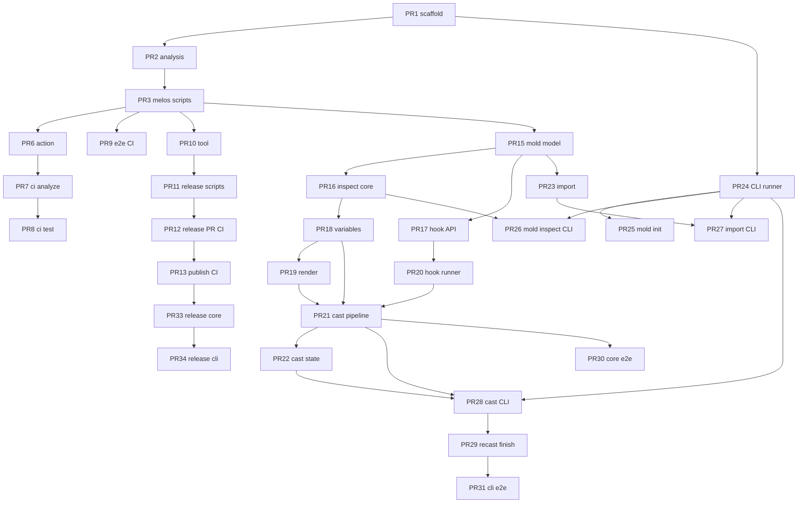

# Foundry — Implementation timeline

Progressive, atomic pull requests to bootstrap the monorepo and deliver **v1** per [REQUIREMENTS.md](REQUIREMENTS.md). This timeline reflects the code-first variable architecture: molds are Dart packages with a root `pubspec.yaml`, expose `FoundryVariableGroup` from `variables.dart`, and collect variable values through a Nocterm-based TUI. Each PR is **self-contained**, builds only on merged work above it, and should be reviewable in isolation.

**References:** [REQUIREMENTS.md](REQUIREMENTS.md) (product spec) · [CONTRIBUTING.md](CONTRIBUTING.md) (layout, Melos, CI/CD, commit/PR conventions, testing, releases) · [Clay](https://github.com/mrverdant13/clay/) (reference implementation)

---

## How to use this document

- Check off `- [ ]` → `- [x]` when a PR is **merged to `main`**.
- **PR title** = squash-merge title — same format as [CONTRIBUTING.md § Commit conventions](CONTRIBUTING.md#commit-conventions) ([Conventional Commits](https://www.conventionalcommits.org/)).
- **Depends on** lists direct prerequisites only.
- **Acceptance criteria** are verifiable without future PRs.

### PR title format

Use scopes `foundry_core` and `foundry_cli` (single or comma-separated when a PR spans both). Release PRs use one package per PR (`chore(foundry_core): release 0.0.1-dev.2`); publish `**foundry_core` before `foundry_cli`**.

| Pattern                        | When                                                                 |
| ------------------------------ | -------------------------------------------------------------------- |
| `chore: …`                     | Cross-cutting setup with no single package owner                     |
| `ci: …`                        | GitHub Actions / CI only                                             |
| `docs: …`                      | Documentation only                                                   |
| `feat(<scope>): …`             | New user-facing behavior in that scope                               |
| `fix(<scope>): …`              | Bug fix in that scope                                                |
| `test(<scope>): …`             | Tests only (no production behavior change)                           |
| `refactor(<scope>): …`         | Internal change, same behavior                                       |
| `feat(a,b): …` / `fix(a,b): …` | Intentional cross-package change (comma-separated scopes, no spaces) |
| `chore(<scope>): release …`    | Release PR for one publishable package                               |

---

## Monorepo bootstrap status

Monorepo scaffolding is complete. Layout, Melos scripts, CI/CD workflows, release
tooling, and contributor docs live in [CONTRIBUTING.md](CONTRIBUTING.md) and the
repo itself. Remaining work in this timeline is product features (Phases 4+), not
bootstrap.

---

## Phase 0 — Documentation baseline

*Already on `main` or in flight before code PRs.*

- [x] **docs: add product requirements specification** — [REQUIREMENTS.md](REQUIREMENTS.md)
- [x] **docs: add contributor guide** — [CONTRIBUTING.md](CONTRIBUTING.md) (monorepo layout, Melos, CI/CD, releases)
- [ ] **docs: add implementation timeline** — this file

---

## Phase 1 — Monorepo foundation

### PR 1 · `chore: scaffold melos workspace and package skeletons`

**Depends on:** Phase 0 docs

**Packages:** root, `foundry_core`, `foundry_cli`, E2E workspace members

**Notes:**

- Copy the workspace structure from [Clay](https://github.com/mrverdant13/clay/tree/main/packages) — root `pubspec.yaml` with `workspace:` entries and minimal `melos:` block (bootstrap only; full scripts in PR 3).
- Each publishable package: `pubspec.yaml` (`resolution: workspace`), `LICENSE` (MIT), `CHANGELOG.md`, `README.md` stub, `lib/src/version.dart` + version sync test stub.
- `foundry_cli`: `bin/foundry.dart` (minimal `main`), `executables: foundry:`.
- `foundry_core`: export barrel `lib/foundry_core.dart`.
- Register E2E packages: `packages/foundry_core/e2e/`, `packages/foundry_cli/e2e/` (empty `test/` or placeholder passing test).
- Set `melos.repository` to the real GitHub URL.

**References:** [Melos getting started](https://melos.invertase.dev/getting-started) · [Dart workspaces](https://dart.dev/tools/pub/workspaces)

**Acceptance criteria:**

- [x] `melos bootstrap` completes without error from a clean clone
- [x] `dart analyze` reports no issues in workspace packages
- [x] `dart run packages/foundry_cli/bin/foundry.dart` exits 0 (stub is fine)
- [x] `foundry_cli` pubspec depends on `foundry_core` via workspace resolution
- [x] Both packages declare `version: 0.0.1-dev.1` aligned with `lib/src/version.dart`

---

### PR 2 · `chore: add shared analysis linting and ignore rules`

**Depends on:** PR 1

**Notes:**

- Root `analysis_options.yaml` with `very_good_analysis`.
- Per-package `analysis_options.yaml` extending root.
- Root `.gitignore` (Clay pattern: `.dart_tool/`, `coverage/`, `melos_overrides.yaml`, etc.).
- `codecov.yml` ignoring `**/fixtures/*`*.

**References:** [Clay `analysis_options.yaml](https://github.com/mrverdant13/clay/blob/main/analysis_options.yaml)` · [Clay `.gitignore](https://github.com/mrverdant13/clay/blob/main/.gitignore)`

**Acceptance criteria:**

- [x] `dart analyze --fatal-infos --fatal-warnings .` passes at repo root
- [x] Analyzer excludes are documented if any paths are skipped
- [x] Generated artifacts (`coverage/`, `.dart_tool/`) are gitignored

---

### PR 3 · `chore: add melos format analyze and test scripts`

**Depends on:** PR 2

**Notes:**

- Port Melos `scripts:` from [Clay root `pubspec.yaml](https://github.com/mrverdant13/clay/blob/main/pubspec.yaml)`: `format`, `format.ci`, `analyze`, `analyze.ci`, `test`, `test.ci`, `coverage.merge`, `coverage.check`, `test.e2e*`.
- Replace package names (`clay_core` → `foundry_core`, `clay_cli` → `foundry_cli`).
- Add placeholder unit tests in both packages so `melos run test.ci` succeeds.
- Defer `release.check` / `release.prepare` to PR 10.

**References:** [Melos scripts](https://melos.invertase.dev/configuration/scripts)

**Acceptance criteria:**

- [x] `melos run format.ci` passes
- [x] `melos run analyze.ci` passes
- [x] `melos run test.ci` passes (placeholder tests OK)
- [x] `melos run coverage.merge` and `coverage.check` run without error (threshold may be 100% on minimal code)

---

## Phase 2 — Contributor docs & editor config

### PR 4 · `docs: add README and CONTRIBUTING`

**Depends on:** PR 1

**Notes:**

- `README.md`: user-facing overview — install (`dart install foundry_cli`), quick start, link to REQUIREMENTS/CONTRIBUTING, pre-release disclaimer (mirror [Clay README](https://github.com/mrverdant13/clay/blob/main/README.md)).
- `CONTRIBUTING.md`: adapt [Clay CONTRIBUTING.md](https://github.com/mrverdant13/clay/blob/main/CONTRIBUTING.md) — scopes `foundry_core`, `foundry_cli`; Melos commands; PR checklist; release runbook.
- Do **not** document unimplemented commands as available; mark as “planned” or omit until feature PRs land.

**Acceptance criteria:**

- [x] README install instructions use `dart install foundry_cli` (not `dart pub global activate`)
- [x] CONTRIBUTING documents Conventional Commits scopes and PR title rules
- [x] CONTRIBUTING links contributor-facing docs only (README, CONTRIBUTING, changelogs)
- [x] No broken internal links

---

### PR 5 · `chore: add vscode launch and task configs` - SKIPPED

**Depends on:** PR 1

**Notes:**

- `.vscode/launch.json` — debug `packages/foundry_cli/bin/foundry.dart`.
- `.vscode/tasks.json` — `melos bootstrap`, `melos run analyze.ci`, `melos run test.ci`.
- Optional; improves DX only.

**References:** [Clay `.vscode/](https://github.com/mrverdant13/clay/tree/main/.vscode)`

**Acceptance criteria:**

- [ ] Launch config runs the CLI entrypoint under the debugger
- [ ] Tasks invoke Melos from repo root with correct `cwd`

---

## Phase 3 — Continuous integration

### PR 6 · `ci: add install-dart-cli composite action`

**Depends on:** PR 3

**Notes:**

- Copy [Clay `.github/actions/install-dart-cli](https://github.com/mrverdant13/clay/tree/main/.github/actions/install-dart-cli)` to pin global CLI versions in workflows (e.g. `melos 7.5.1`).

**Acceptance criteria:**

- [x] Composite action installs a pinned Dart global package when invoked from a workflow
- [x] Action inputs documented in `action.yaml`

---

### PR 7 · `ci: add format and analyze workflow`

**Depends on:** PR 6

**Notes:**

- Add `.github/workflows/ci.yaml` with `**min-conditions`** job only first: checkout → `dart-lang/setup-dart` → install melos → `melos bs` → `format.ci` + `analyze.ci`.
- Triggers: PR + push to `main`, `workflow_dispatch`.

**References:** [Clay `ci.yaml](https://github.com/mrverdant13/clay/blob/main/.github/workflows/ci.yaml)` (min-conditions job)

**Acceptance criteria:**

- [x] Workflow runs on PR to `main`
- [x] Fails if code is unformatted (`format.ci`)
- [x] Fails on analyzer warnings (`analyze.ci`)
- [x] `melos bs` runs before checks

---

### PR 8 · `ci: add unit test matrix and codecov upload`

**Depends on:** PR 7

**Notes:**

- Extend `ci.yaml`: `test` job (matrix: ubuntu, macOS, Windows) → `test.ci` → `coverage.merge` → `coverage.check`; upload `filtered.lcov.info` artifact from Ubuntu.
- Add `codecov` job (requires `CODECOV_TOKEN` secret — document in CONTRIBUTING).
- Split from PR 7 so analyze CI is usable before coverage secrets exist.

**Acceptance criteria:**

- [x] Test job passes on all three OS runners
- [x] Coverage merge produces `coverage/filtered.lcov.info` on Ubuntu
- [x] Codecov job uploads artifact (or skips gracefully if secret missing — document expected setup) *(job commented out pending `CODECOV_TOKEN`; artifact upload retained)*

---

### PR 9 · `ci: add e2e workflow and e2e package scaffolding`

**Depends on:** PR 3

**Notes:**

- `.github/workflows/e2e.yaml` with 5-minute budget policy (6-minute workflow timeout).
- Ensure E2E packages have `pubspec.yaml`, `analysis_options.yaml`, and a **passing placeholder** E2E test tagged `e2e`.
- `melos run test.e2e.all` must succeed before merge.

**References:** [Clay `e2e.yaml](https://github.com/mrverdant13/clay/blob/main/.github/workflows/e2e.yaml)`

**Acceptance criteria:**

- [x] `melos run test.e2e.all` passes locally
- [x] E2E workflow completes within 6-minute job timeout
- [x] E2E tests tagged so unit `test.ci` excludes them (`--exclude-tags ci-only` / `e2e` tag pattern from Clay)

---

## Phase 4 — Release infrastructure

*Required before first pub.dev publish; not blocking feature development.*

### PR 10 · `chore: add release tooling scripts`

**Depends on:** PR 3

**Notes:**

- Add `tool/pubspec.yaml` (`foundry_tooling`, `publish_to: none`) and adapt from Clay:
  - `prepare_package_release.dart`
  - `sync_package_version.dart`
  - `wait_for_pub_dev_version.dart`
  - `package_configs.dart` (if used)
- Unit tests under `tool/test/` for version sync logic.

**References:** [Clay `tool/](https://github.com/mrverdant13/clay/tree/main/tool)`

**Acceptance criteria:**

- [x] `dart run tool/sync_package_version.dart --cwd packages/foundry_core` updates `version.dart` from pubspec (dry-run documented)
- [x] Tool package analyzes cleanly
- [x] Tool tests pass via `dart test` in `tool/`

---

### PR 11 · `chore: add melos release check and prepare scripts`

**Depends on:** PR 10

**Notes:**

- Add `release.check`, `release.prepare`, `pub-score.local`, `pub-score.remote` to root Melos config (Clay port).
- Tag format: `{name}/{version}` → `foundry_core/0.0.1-dev.2`.
- `release.prepare` uses `--bump build` for dev releases.

**Acceptance criteria:**

- [x] `MELOS_PACKAGES=foundry_core melos run release.check` runs format, analyze, test, pub-score, and publish dry-run for that package only
- [x] `MELOS_PACKAGES=foundry_core melos run release.prepare` dry-run (without `--apply` in local test) prints intended version/changelog diff

---

### PR 12 · `ci: add release prepare and release pr check workflows`

**Depends on:** PR 11

**Notes:**

- `prepare-release.yaml` — workflow_dispatch, package choice `foundry_core` | `foundry_cli`.
- `release-pr.yaml` — runs scoped `release.check` when PR title matches `chore(<pkg>): release <version>`.

**References:** [Clay release workflows](https://github.com/mrverdant13/clay/tree/main/.github/workflows)

**Acceptance criteria:**

- [x] Prepare workflow file validates against GitHub Actions schema
- [x] Release PR check triggers only on release PR title/branch pattern (document regex in workflow comments)
- [x] Package choices are `foundry_core` and `foundry_cli` only

---

### PR 13 · `ci: add release tag and publish workflows`

**Depends on:** PR 12

**Notes:**

- `release-tag.yaml` — annotated tag on merge commit `<package>/<version>`.
- `publish.yaml` — OIDC publish via `dart-lang/setup-dart`, `dry_run` default `true`, live publish on tag ref only.
- Document `pub-dev-publish` environment and pub.dev tag patterns in CONTRIBUTING (no secrets in repo).

**References:** [Dart automated publishing](https://dart.dev/tools/pub/automated-publishing)

**Acceptance criteria:**

- [x] Publish workflow rejects live publish when dispatched from a branch ref
- [x] Tag workflow validates release PR branch name `foundry_core/chore/release-<version>`
- [x] Workflows reference `foundry_core` and `foundry_cli` (not clay names)

---

### PR 14 · `ci: add remote pub dev score check workflow`

**Depends on:** PR 11

**Notes:**

- `check_remote_pub_score.yaml` — nightly + manual; skip packages not yet on pub.dev.

**Acceptance criteria:**

- [x] Workflow runs `pub_score_checker` for each publishable package when listed on pub.dev
- [x] Skips gracefully with notice when package is unpublished

---

## Phase 5 — `foundry_core` library

Implement core behavior testable **without** spawning the CLI. Spec: [REQUIREMENTS.md §4–7](REQUIREMENTS.md).

### PR 15 · `feat(foundry_core): add mold package model and definition loader`

**Depends on:** PR 3

**Notes:**

- Parse mold root `pubspec.yaml`: required `name`, `description`, `version`; require `foundry_core` dependency.
- Run `dart pub get` in the mold directory before loading `variables.dart`.
- Discover required root `variables.dart` and top-level `moldVariables` contract using the mold's package config.
- Convention-based hook paths: `hooks/prepare.dart`, `hooks/shape.dart`, `hooks/finish.dart`.
- Typed models + validation errors suitable for inspect/cast.
- Add `liquify` and `yaml` dependencies here or in PR 19 (if only needed for rendering, defer).

**References:** [REQUIREMENTS.md §4.1](REQUIREMENTS.md#41-root-pubspecyaml) · [Mason `brick.yaml](https://github.com/felangel/mason/blob/master/bricks/app/brick.yaml)` (manifest comparison)

**Acceptance criteria:**

- [x] Unit tests load a valid mold directory (`pubspec.yaml` + `variables.dart`) into a `Mold` model
- [x] Missing required pubspec fields produce structured parse/validation errors
- [x] Missing `variables.dart`, missing `moldVariables`, or missing `foundry_core` dependency is rejected at load time
- [x] Public API exported from `package:foundry_core/foundry_core.dart`

---

### PR 16 · `feat(foundry_core): add mold inspection and definition validation`

**Depends on:** PR 15

**Notes:**

- Implement inspect logic used by `foundry mold inspect`: `variables.dart` existence, `moldVariables` loadability, hook path existence, template dir presence.
- Return a structured report (issues list with severity/path/message).

**References:** [REQUIREMENTS.md §5.4](REQUIREMENTS.md#54-resolution-order) (broad recomputation)

**Acceptance criteria:**

- [ ] Inspect loads `moldVariables` successfully from a valid `variables.dart`
- [ ] Inspect verifies `template/` exists
- [ ] Inspect flags missing standard hook files under `hooks/` when referenced by cast phases
- [ ] Unit tests cover valid mold, missing `variables.dart`, and missing template dir

---

### PR 17 · `feat(foundry_core): add hook context logger and exceptions`

**Depends on:** PR 15

**Notes:**

- Export Mason-aligned hook API: `HookContext`, `HookException`, `Logger` per [REQUIREMENTS.md §6.2](REQUIREMENTS.md#62-hook-specification).
- `HookContext` fields: `vars`, `logger`, `moldDirectory`, `outputDirectory`.
- No subprocess spawning yet — types + logger implementation only.

**References:** [Mason hooks](https://docs.brickhub.dev/hooks/)

**Acceptance criteria:**

- [ ] `HookContext` is mutable for `vars` as specified
- [ ] `Logger` supports info/warn/error/progress (API covered by unit tests)
- [ ] `HookException` is exported and documented in dartdoc
- [ ] Example hook snippet in tests compiles against public API

---

### PR 18 · `feat(foundry_core): add FoundryVariableGroup runtime`

**Depends on:** PR 15, PR 16

**Notes:**

- Implement `FoundryVariableGroup` and variable kinds for strings, booleans, numbers, objects, single-choice, multiple-choice, and repeatable values.
- Resolution order per [REQUIREMENTS.md §5.4](REQUIREMENTS.md#54-resolution-order): load `moldVariables` → broad recomputation of `visibleWhen` / `defaultValue` → validation.
- Support per-field validators and group validators.
- Expose a serializable resolved value map for hooks and Liquid rendering.

**References:** [liquify](https://pub.dev/packages/liquify)

**Acceptance criteria:**

- [ ] Unit tests: `visibleWhen` false skips variable
- [ ] Unit tests: `defaultValue` prepopulates dependent variable
- [ ] Unit tests: invalid field or group validation returns actionable error
- [ ] Unit tests: single-choice rejects out-of-range values
- [ ] Unit tests: recomputation refreshes visibility/defaults after an upstream value change

---

### PR 19 · `feat(foundry_core): add liquid template rendering for cast`

**Depends on:** PR 18

**Notes:**

- Render files under `template/` to output paths; Liquid in file contents and path segments.
- Integrate `glob` / filesystem walk; respect `--force` overwrite semantics at renderer level (caller passes flag).
- Does not run hooks or full cast yet.

**References:** [REQUIREMENTS.md §4.3](REQUIREMENTS.md#43-template) · [REQUIREMENTS.md §6.3](REQUIREMENTS.md#63-template-rendering)

**Acceptance criteria:**

- [ ] Unit tests render fixture template dir to temp output with expected file contents
- [ ] Dynamic path segments (Liquid in filenames) produce correct paths
- [ ] Renderer leaves unrelated existing files untouched when overwriting selected paths
- [ ] Liquid filters used in REQUIREMENTS examples (`snake_case`, `pascal_case`) work or are registered with documented names

---

### PR 20 · `feat(foundry_core): add hook process runner`

**Depends on:** PR 17

**Notes:**

- Spawn Dart hook (`dart run`) from the mold root package (cwd = `outputDirectory`).
- Invoke `run(HookContext)` entrypoint for prepare/shape/finish phases.
- `--no-hooks` respected at orchestration boundary (API flag).
- Uncaught exceptions → failure; cwd = `outputDirectory`.

**References:** [Mason hooks execution](https://docs.brickhub.dev/hooks/)

**Acceptance criteria:**

- [ ] Integration test runs fixture hook that mutates `context.vars`
- [ ] Missing hook file → no-op for that phase
- [ ] Hook throwing `HookException` propagates as failure
- [ ] Hook process cwd is output directory (assert in test)

---

### PR 21 · `feat(foundry_core): add cast pipeline orchestration`

**Depends on:** PR 18, PR 19, PR 20

**Notes:**

- End-to-end cast: prepare → resolve vars → shape → render → finish.
- Single entry API e.g. `CastRunner.cast(moldPath, outputPath, resolvedVars, {force, noHooks})`.
- Exit semantics: distinguish user errors vs internal errors for CLI mapping later.

**References:** [REQUIREMENTS.md §6.1](REQUIREMENTS.md#61-end-to-end-flow)

**Acceptance criteria:**

- [ ] Integration test casts fixture mold to temp dir with a resolved variable map
- [ ] Pipeline runs prepare before var resolution and shape after
- [ ] `--no-hooks` skips all hook phases (tested)
- [ ] Failed cast leaves partial artifacts (no rollback) — documented behavior verified
- [ ] Successful cast returns artifact file count or equivalent summary data

---

### PR 22 · `feat(foundry_core): add cast state persistence`

**Depends on:** PR 21

**Notes:**

- Write/read `.foundry/last_cast.json` in process cwd per [REQUIREMENTS.md §3.3](REQUIREMENTS.md#33-cast-state-recast--finish).
- Schema: `moldPath`, `outputPath`, `vars`, `timestamp` (ISO-8601).

**Acceptance criteria:**

- [ ] After successful cast, JSON file written to cwd `.foundry/`
- [ ] Read API returns parsed state; missing file → structured not-found error
- [ ] Unit tests use fixed clock or regex for timestamp field

---

### PR 23 · `feat(foundry_core): add mold import git and local transports`

**Depends on:** PR 15

**Notes:**

- Git: shallow clone (+ optional `--path` sparse/subdir copy) to temp, copy to `./<name>/`.
- Local: copy directory to `./<name>/`.
- Fail if destination exists unless `force`; `<name>` from mold manifest.

**References:** [REQUIREMENTS.md §7](REQUIREMENTS.md#7-mold-import)

**Acceptance criteria:**

- [ ] Local import copies fixture mold to destination named after manifest `name`
- [ ] Import fails when destination exists and `force` is false
- [ ] Git import tested with local git fixture repo (file://) or mocked subprocess
- [ ] Temp directories cleaned up after import

---

## Phase 6 — `foundry_cli` commands

Thin CLI over `foundry_core`. Spec: [REQUIREMENTS.md §3](REQUIREMENTS.md#3-cli-commands), [§8](REQUIREMENTS.md#8-user-facing-output-and-messaging).

### PR 24 · `feat(foundry_cli): add command runner and version flag`

**Depends on:** PR 1, PR 15 (optional: only needs package version)

**Notes:**

- `args`-based command runner with resource grouping (`mold`, top-level `cast`/`recast`/`finish`).
- Global `--version` printing `foundryCliVersion` from `lib/src/version.dart`.
- Exit codes: 0 success, 64 usage (optional), 70 config — align with Clay/Mason conventions for usage errors.

**References:** [Clay CLI structure](https://github.com/mrverdant13/clay/tree/main/packages/clay_cli)

**Acceptance criteria:**

- [ ] `dart run packages/foundry_cli/bin/foundry.dart --version` prints semver matching pubspec
- [ ] Unknown command prints usage and exits non-zero
- [ ] Command tests cover `--version` and invalid invocation stderr

---

### PR 25 · `feat(foundry_cli): add mold init command`

**Depends on:** PR 24

**Notes:**

- `foundry mold init [--name=<name>]` scaffolds root `pubspec.yaml` (with `foundry_core` dependency), `variables.dart`, `template/`, and `hooks/`.

**References:** [REQUIREMENTS.md §3.1](REQUIREMENTS.md#31-mold)

**Acceptance criteria:**

- [ ] Init in empty temp dir creates expected tree
- [ ] Generated root `pubspec.yaml` depends on `foundry_core`
- [ ] Generated `variables.dart` includes placeholder `moldVariables` group
- [ ] Command test asserts exit 0 and file presence

---

### PR 26 · `feat(foundry_cli): add mold inspect command`

**Depends on:** PR 24, PR 16

**Notes:**

- `foundry mold inspect [<path>]` — default cwd; delegate to core inspect; human-readable issue output.

**Acceptance criteria:**

- [ ] Valid fixture mold → exit 0
- [ ] Invalid mold → exit 1 with actionable stderr
- [ ] Defaults to cwd when path omitted (command test)

---

### PR 27 · `feat(foundry_cli): add mold import commands`

**Depends on:** PR 24, PR 23

**Notes:**

- `foundry mold import git --git-url=… [--path=] [--force]`
- `foundry mold import local --path=… [--force]`

**Acceptance criteria:**

- [ ] Local import CLI copies mold to `./<name>/` under cwd
- [ ] Duplicate destination without `--force` → exit 1
- [ ] `--force` overwrites or replaces per spec
- [ ] Command tests mock or use fixture paths (no network in unit tests)

---

### PR 28 · `feat(foundry_cli): add cast command and Nocterm TUI`

**Depends on:** PR 24, PR 21, PR 22

**Notes:**

- `foundry cast <mold-path> --output=<dir> [--force] [--no-hooks]`
- Load `variables.dart`, render a Nocterm-based TUI, collect validated values, then pass the resolved map to `foundry_core`.
- User messaging per [REQUIREMENTS.md §8](REQUIREMENTS.md#8-user-facing-output-and-messaging).
- Write `.foundry/last_cast.json` on success via core.

**Acceptance criteria:**

- [ ] Cast fixture mold produces artifacts under `--output`
- [ ] Missing required `--output` → usage error, exit non-zero
- [ ] Invalid variable input keeps the TUI in a failed state until corrected or aborted
- [ ] Non-empty output without `--force` → exit 1
- [ ] Success stdout includes “Cast completed” and artifact count
- [ ] `last_cast.json` written in process cwd after success

---

### PR 29 · `feat(foundry_cli): add recast and finish commands`

**Depends on:** PR 28, PR 20, PR 22

**Notes:**

- `foundry recast [--force] [--no-hooks]` — replay from `last_cast.json`.
- `foundry finish [--no-hooks]` — run finish hook only against stored output.

**References:** [REQUIREMENTS.md §3.3](REQUIREMENTS.md#33-cast-state-recast--finish)

**Acceptance criteria:**

- [ ] `recast` without prior cast file → clear error, exit 1
- [ ] `recast` repeats last cast with same paths/resolved vars
- [ ] `finish` runs finish hook without re-rendering templates
- [ ] `finish` fails when no finish hook defined (clear error)
- [ ] Both commands honor `--no-hooks`

---

## Phase 7 — End-to-end tests

### PR 30 · `test(foundry_core): add cast pipeline e2e tests`

**Depends on:** PR 21

**Notes:**

- `packages/foundry_core/e2e/`: fixture molds, call public API (not CLI).
- Tag tests `e2e`; keep suite under 5-minute CI budget.

**References:** [Clay `packages/clay_core/e2e](https://github.com/mrverdant13/clay/tree/main/packages/clay_core/e2e)`

**Acceptance criteria:**

- [ ] At least one e2e test runs full cast including hooks using fixture mold
- [ ] `melos run test.e2e.ci` passes for `foundry_core` e2e package
- [ ] Fixtures live under `e2e/` and are ignored by coverage per `codecov.yml`

---

### PR 31 · `test(foundry_cli): add cli e2e tests with fixtures`

**Depends on:** PR 29

**Notes:**

- `packages/foundry_cli/e2e/`: spawn `dart run …/foundry.dart` for init → cast → recast → finish happy path, scripting terminal interaction for the Nocterm flow.
- Golden or directory-tree comparison for generated artifacts.

**References:** [Clay `packages/clay_cli/e2e](https://github.com/mrverdant13/clay/tree/main/packages/clay_cli/e2e)`

**Acceptance criteria:**

- [ ] E2E covers `mold init`, `cast`, and `recast` via CLI subprocess
- [ ] E2E covers import local transport
- [ ] `melos run test.e2e.all` passes within CI timeout
- [ ] No flaky network git tests in default e2e (use local fixtures)

---

## Phase 8 — Documentation & release readiness

### PR 32 · `docs: add variables.dart authoring guide and user reference`

**Depends on:** PR 15, PR 17

**Notes:**

- `doc/variables.md` describing `FoundryVariableGroup`, variable kinds, dependencies, defaults, validators, and Nocterm behavior.
- `doc/hooks.md` — hook phases, mold `pubspec.yaml` + `foundry_core` dependency, example hook entrypoint.
- Update README with command reference once PRs 25–29 are merged (or split README update into each CLI PR if preferred).

**Acceptance criteria:**

- [ ] Variables authoring doc matches the `variables.dart` example from [REQUIREMENTS.md §11](REQUIREMENTS.md#11-reference-example)
- [ ] Hook doc matches REQUIREMENTS §6.2 (import path, context fields)
- [ ] README lists all v1 commands with copy-paste examples

---

### PR 33 · `chore(foundry_core): prepare first pub dev release`

**Depends on:** PR 13, PR 30, Phase 5–7 feature PRs merged

**Notes:**

- Run release prepare workflow for `foundry_core` only first ([CONTRIBUTING.md release order](CONTRIBUTING.md#dart-package-releases)).
- Ensure pub.dev automated publishing configured for `foundry_core/{{version}}`.
- Changelog entries from conventional commits since init.

**Acceptance criteria:**

- [ ] Release PR titled `chore(foundry_core): release 0.0.1-dev.x` passes `release.check` CI
- [ ] Merge creates annotated tag `foundry_core/<version>`
- [ ] Dry-run publish workflow succeeds on tag ref

---

### PR 34 · `chore(foundry_cli): prepare first pub dev release`

**Depends on:** PR 33

**Notes:**

- Bump `foundry_core` constraint in `foundry_cli/pubspec.yaml` to published core version.
- Release PR for `foundry_cli`; tag `foundry_cli/<version>`.
- Verify `dart install foundry_cli` instructions in README after publish.

**Acceptance criteria:**

- [ ] `foundry_cli` depends on published `foundry_core` semver
- [ ] Release PR passes scoped `release.check`
- [ ] Dry-run publish succeeds; live publish documented as manual dispatch step
- [ ] Post-publish smoke: `foundry --version` works after `dart install foundry_cli`

---

## Dependency graph (summary)

---

## Out of scope for this timeline (v1 non-goals)

Per [REQUIREMENTS.md §10](REQUIREMENTS.md#10-non-goals-v1):

- `foundry mold derive`, pattern workflow, template registry / hub
- Non-interactive variable flags / batch mode
- JavaScript hooks
- Foundry workspace manifest (`foundry.yaml`)
- Automatic rollback on failed cast

Track these separately if scope expands.
